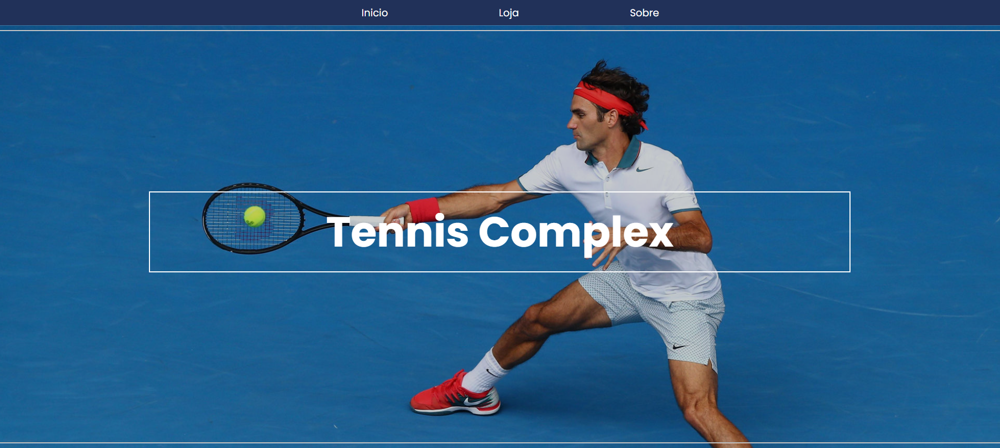
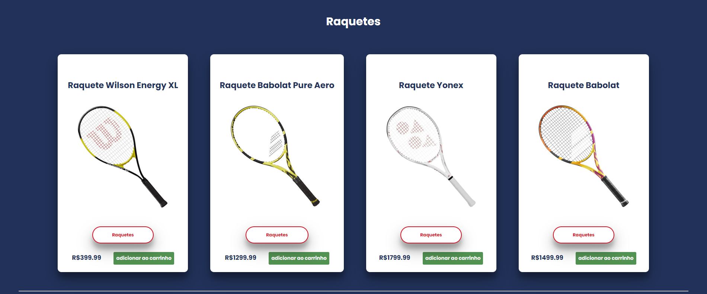
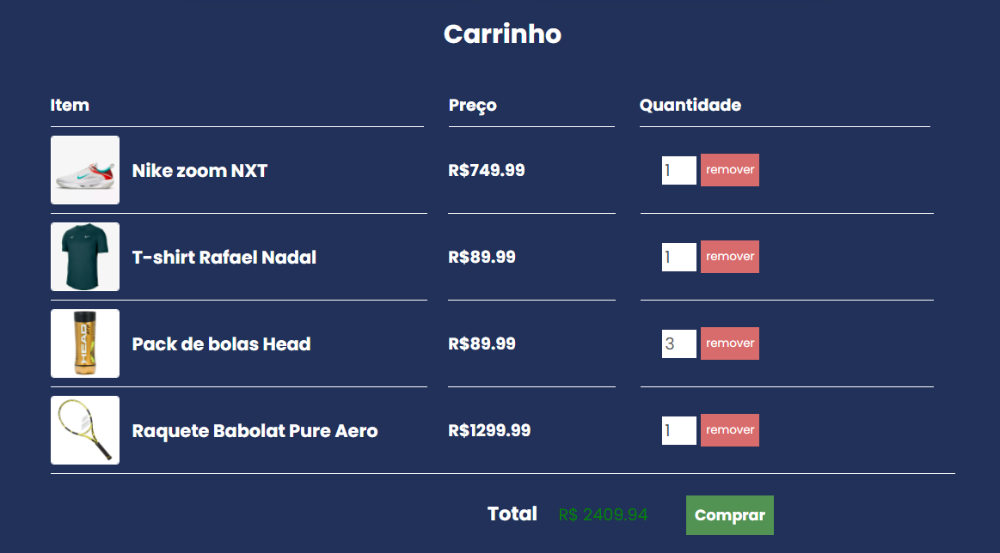

# Tennis Complex

<!---Esses são exemplos. Veja https://shields.io para outras pessoas ou para personalizar este conjunto de escudos. Você pode querer incluir dependências, status do projeto e informações de licença aqui--->

> Projeto criado para colocar em prática principalmente os estudos em vanilla JS, implementando a parte front-end de uma loja virtual fictícia de artigos de Tenis.

### Ajustes e melhorias

O projeto ainda está em desenvolvimento e as próximas atualizações serão voltadas nas seguintes tarefas:

- [x] Parte visual utilizando SCSS
- [x] Implementar funcionalidades básicas de uma loja virtual
- [ ] Modal de confirmação de compra
- [ ] Criar funcionalidade de registrar novos produtos
- [ ] Adicionar responsividade mobile